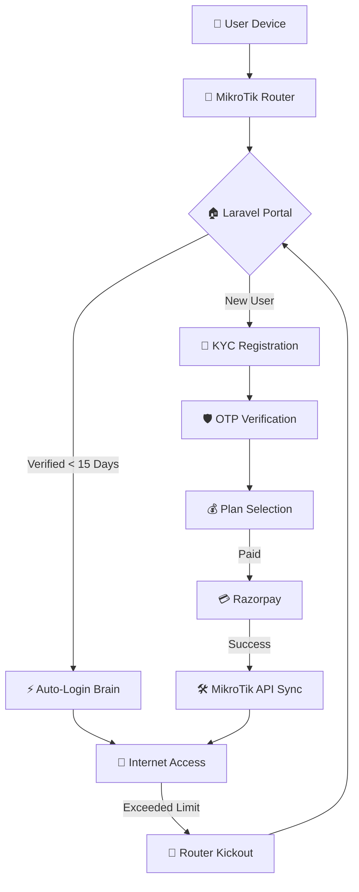

# 📶 **MIKROTIK CAPTIVE PORTAL — SAAS MASTER MASTER MASTER PLAN** 🚀

## 📜 **CURRENT STATUS: PHASE 3 (LIMITS & ENFORCEMENT) 🔓**
The system is now **Functional, Paying, and Verified**. We are now moving to **Limit Enforcement** to protect your revenue.

---

## 🗺️ **ARCHITECTURE OVERVIEW**

---

## 🛠️ **PHASE PROGRESS:**

### ✅ **PHASE 1: REDIRECT & POPUP (COMPLETE)**
*   **Redirector:** MikroTik `hotspot/login.html` meta-refresh to Laravel. 🚀
*   **Auto-Popup:** Walled Garden bypass to force mobile "Sign in to network" notifications. 🚀
*   **15-Day Brain:** MAC recognition to bypass login for returning users. 🚀

### ✅ **PHASE 2: KYC & VERIFICATION (COMPLETE)**
*   **Verification:** Mandatory Name, Address, and Mobile data capture (Legal Forensics). 🚀
*   **ID Check:** Optional Aadhar/ID details for 14-month compliance. 🚀
*   **OTP Brain:** SMS verification integrated with the "SaaS Brain". 🚀

### 🚧 **PHASE 3: LIMIT ENFORCEMENT & SHIELD (CURRENT)**
*   **Bandwidth Control:** Apply `limit-bytes-total` (e.g., 1GB) via API. 🚀
*   **Time Control:** Apply `limit-uptime` (e.g., 24 Hours) via API. 🚀
*   **Profile Mapping:** Link MikroTik profiles (1MB/5MB/10MB) to Laravel plans. 🚀

---

## 🛡️ **LEGAL & FORENSIC COMPLIANCE**
*   **14-Month Logs:** Maintaining session time, IP, MAC, and KYC data. 🎯
*   **Auto-Pruning:** Weekly task to delete sessions > 1,021,248 minutes (14 months). 🎯
*   **Misuse Clause:** Registration form requires legal declaration acknowledgment. 🎯

---

## 🏰 **PHASE 4: THE ADMIN CASTLE (DASHBOARD)**
The central command center for the SaaS owner to monitor revenue, users, and performance.

### 🛡️ **ADMIN ACCESS:**
*   **Username:** `admin` or `admin@1209` (As provided by user) 🚀
*   **Password:** `admin@123` 🚀

### 🏰 **DASHBOARD MODULES:**
1.  **Plan Manager:**
    *   Dynamic CRUD for speed, data limits (GB), and time limits (m). 🚀
    *   Mikrotik Profile mapping for instant sync. 🚀
2.  **KYC Management (User Table):**
    *   Full searchable table of Names, Mobile, and Addresses. 🚀
    *   Export data for legal compliance checks. 🚀
3.  **Revenue & Transactions:**
    *   Real-time Razorpay payment tracking. 🚀
    *   Daily, Weekly, and Monthly income totals. 🚀
4.  **Forensic Cleanup:**
    *   Automated scheduler for 14-month history pruning. 🚀

---

## 🏗️ **PHASE 5: THE WANI DISTRIBUTION NETWORK (PDO HIERARCHY)**
The system is evolving into a full-scale PM-WANI style revenue engine.

### 🛡️ **USER HIERARCHY:**
1.  **ADMIN (MASTER OVERLORD):** 
    *   Creates **Master PDOs** and regular **PDOs**. 🚀
    *   Controls Global Commission rates. 🚀
2.  **MASTER PDO:** 
    *   Manages a fleet of individual PDOs. 🚀
    *   Earns a **distribution commission** on every transaction in their network. 🚀
3.  **PDO (Public Data Office):** 
    *   Owns the MikroTik router and physical location. 🚀
    *   Earns a **location commission** on every user payment. 🚀

### 📶 **ROUTER & PDO MONITORING:**
*   **Live Status:** Admin/PDO can see "Online/Offline" icons for every Router ID. 🚀
*   **PDO Trace:** Trace Router performance by Name and Mobile of the PDO Owner. 🚀
*   **Commission Engine:** Auto-calculate earnings for Master PDO and regular PDO after every Razorpay success. 🚀

---

## 📈 **FUTURE REVENUE PLAN:**
*   **Master PDO Commision:** 2% - 5% per transaction. 🚀
*   **PDO Commision:** 60% - 80% per transaction. 🚀
*   **Admin Fee:** 15% - 30% for SaaS maintenance. 🚀

---

## 🏁 **MASTER MASTER MASTER MASTER VISION 🌟**
"User → MikroTik → Laravel → Plan → Commission → Internet" — **THE ULTIMATE ISP SaaS.** 🎯🏎️💨
