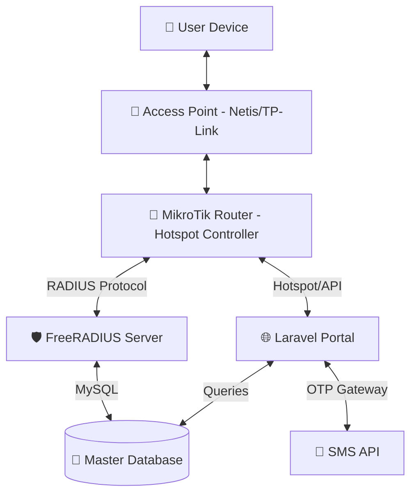

# 📶 **ULTIMATE MIKROTIK CAPTIVE PORTAL - FULL MASTER IMPLEMENTATION PLAN** 🚀
## *Enterprise-Grade SaaS with FreeRADIUS, OTP Verification & 14-Month Compliance*

This document outlines the complete architectural blueprint and implementation steps for building a robust, commercial-grade WiFi Hotspot management system using **MikroTik RouterOS**, **Laravel (PHP)**, and **FreeRADIUS**.

---

## 🏗️ 1. SYSTEM ARCHITECTURE
The system operates on a four-tier architecture to ensure maximum performance and data integrity.

> [!NOTE]
> **AP Configuration**: The Netis AP must be in **Bridge Mode** (DHCP Disabled). This ensures the MikroTik router sees the actual **MAC Address** of the User Device, not the AP's MAC.

---

## 🛠️ 2. MIKROTIK (WINBOX) SETUP: POST-RESET GUIDE
*Follow these steps precisely after a hardware reset (No Default Config).*

### **Step A: Basic IP & Internet**
1.  **IP > Addresses**: Assign IP to `ether1` (WAN) and `bridge` (LAN).
2.  **IP > DNS**: Set `8.8.8.8` and `1.1.1.1`. Check "Allow Remote Requests".
3.  **IP > Firewall > NAT**: Add `chain=srcnat action=masquerade out-interface=ether1`.

### **Step B: Hotspot Setup**
1.  **IP > Hotspot > Setup**: Select `bridge` (LAN) and follow the wizard.
2.  **Server Profile**: 
    *   **Login**: Check `HTTP CHAP`, `HTTP PAP`, and **RADIUS**.
    *   **RADIUS**: Check "Use RADIUS".
3.  **Walled Garden**: Add your Laravel Server IP/Domain to allow users to access the portal before login.

### **Step C: RADIUS Client**
1.  **Radius > Add New**:
    *   **Service**: Check `hotspot`.
    *   **Address**: Your Server IP.
    *   **Secret**: `your_radius_secret`.
2.  **Radius > Incoming**: Enable "Accept" and Port `3799`.

---

## 📲 3. USER FLOW & AUTHENTICATION LOGIC
*Designed for maximum security and ease of use.*

### **A. Connection & Redirection**
1.  User connects to WiFi → MikroTik detects MAC address.
2.  Router redirects to `http://your-portal.com/hotspot-login?mac={mac}&ip={ip}`.

### **B. Registration & OTP Engine**
*   **Case 1: First-Time User**
    *   Input Mobile Number → Verify via OTP.
    *   Open Registration Form (Name, Address, KYC).
    *   Create Profile → Redirect to Plans Page.
*   **Case 2: Returning User (MAC Registered)**
    *   Check `last_verified_at`: 
        *   If `< 15 days`: Show "Auto-Logon" button or auto-redirect to Usage Page.
        *   If `> 15 days`: Request OTP Verification again for security.
*   **Case 3: Multiple Numbers on One MAC**
    *   Allow one MAC to bind with multiple mobile numbers after OTP verification.

### **C. Active Plan Check**
*   If user has an active plan → Authenticate via RADIUS and show **Live Usage Dashboard**.
*   If no plan → Redirect to **Payment/Plans Page**.

---

## 📊 4. DATA CONTROL & USAGE TRACKING (FreeRADIUS)
Utilizing FreeRADIUS for real-time data enforcement.

### **Database Integration (MySQL)**
*   **`radcheck`**: Stores usernames (Mobile) and passwords (MAC).
*   **`radreply`**: Stores attributes like `Mikrotik-Rate-Limit` (Speed) and `Max-All-MB` (Data Limit).
*   **`radacct`**: Real-time accounting logs for data usage calculation.

### **Usage Dashboard Features**
1.  **Daily Usage**: Total MB/GB consumed in the last 24 hours.
2.  **Monthly Usage**: Graph showing data consumption vs. plan limit.
3.  **Live Session**: Shows current uptime and data speed.

---

## 🛡️ 5. COMPLIANCE & LOG MANAGEMENT
*Meeting Government Security Guidelines (14-Month Retention).*

### **Forensic Logging**
*   **Table `access_logs`**: Stores `User_ID`, `MAC`, `Assigned_IP`, `Login_Time`, `Logout_Time`, and `Total_Bytes`.
*   **Retention Policy**: 
    *   Every midnight, a cron job executes.
    *   Logs older than 14 months (426 days) are archived or pruned.
    *   KYC data is kept indefinitely or as per secondary guidelines.

---

## 🏰 6. ADMIN CONTROL CENTER
1.  **Dashboard**: Revenue stats, Online Users, Router Health.
2.  **User Management**: Search user by Mobile or MAC, view KYC documents.
3.  **Plan Manager**: Create plans (e.g., 10GB for 1 Month @ ₹199). Syncs automatically with RADIUS profiles.
4.  **Forensic Search**: Track which MAC used what IP at any given timestamp in the last 14 months.

---

## 🚀 7. NEXT STEPS FOR IMPLEMENTATION
1.  **Database Refactoring**: Set up standard FreeRADIUS tables (radcheck, radreply, radacct).
2.  **OTP Service Integration**: Connect MSG91, Twilio, or local gateway.
3.  **MikroTik API Wrapper**: For kicking users or dynamic speed changes.
4.  **UI Polish**: Premium Dark Mode dashboard with high-quality charts.

---
*Plan created by Antigravity AI - 2026*
